

  

FACULTÉ DES SCIENCES ET DES TECHNOLOGIES

 

(FST)

 

 Troisième année

 

<b>RAPPORT</b>

<b>Sur le Travail de Laboratoire Nº2</b>

<b>COURS</b>

<b>Réseaux 2</b>

<b>PROFESSEUR</b>

<b>Ismael SAINT AMOUR</b>

<b>PRÉPARÉ PAR</b>

<b>Peterson CHERY</b>

<b>SEMESTRE</b>

<b>II</b>

<b>
  Le 28/03/2025
</b>

#### 1) Installation et importation GNS3 dans VirtualBox.
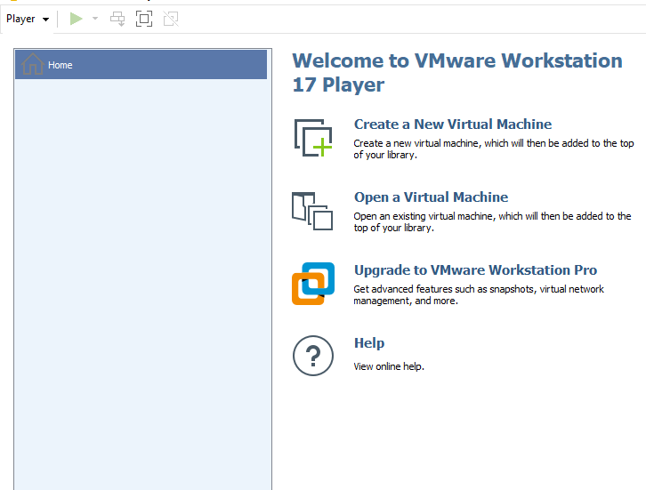{width=500px}
************************************************************
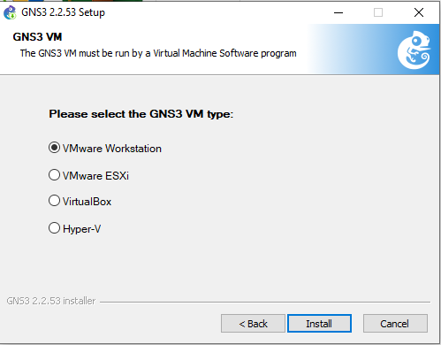{width=500px}
************************************************************
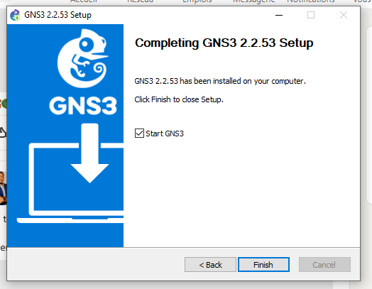{width=500px}
************************************************************
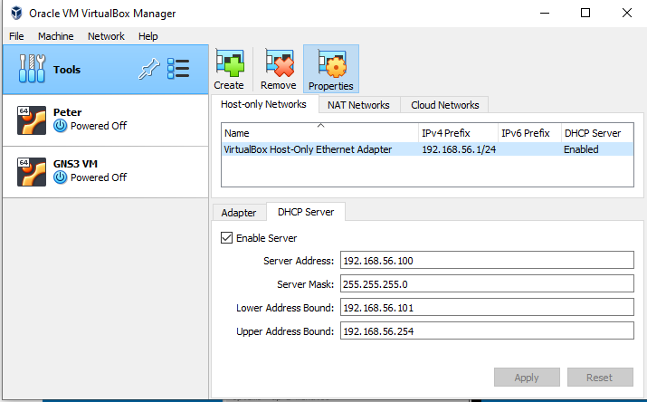{width=500px}
************************************************************
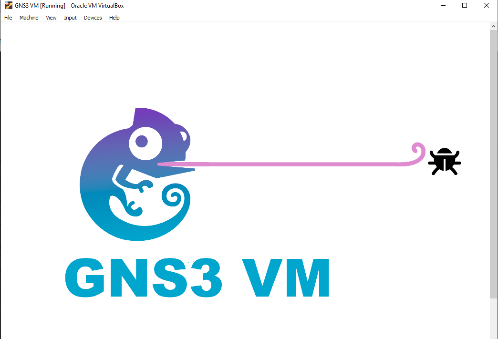{width=500px}
************************************************************
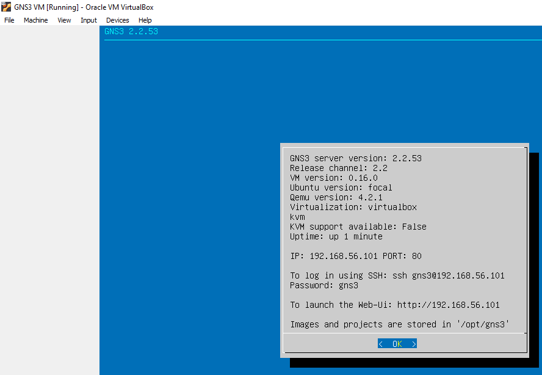{width=500px}
#### Importation du routeur
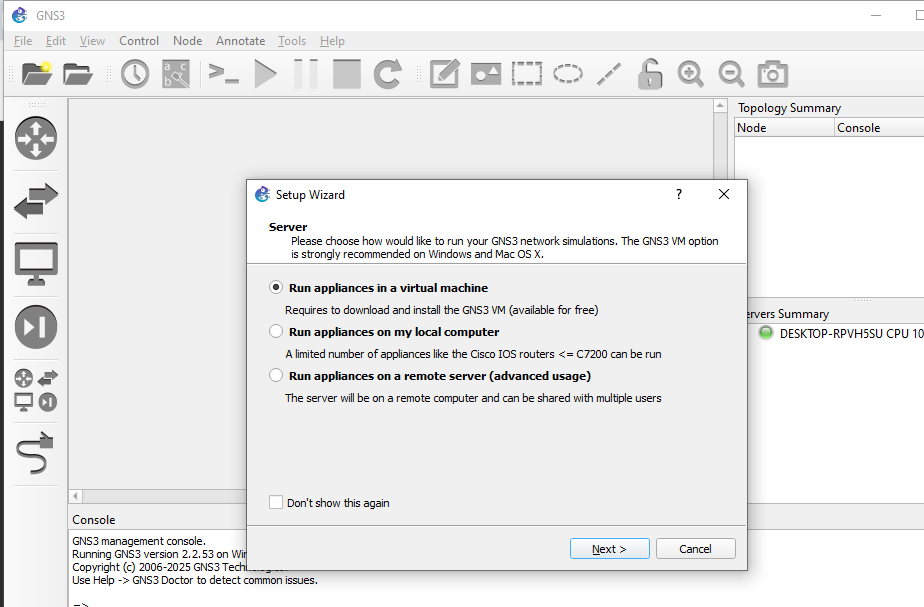{width=500px}
************************************************************
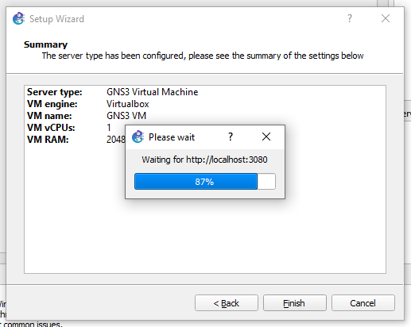{width=500px}
************************************************************
{width=500px}
************************************************************
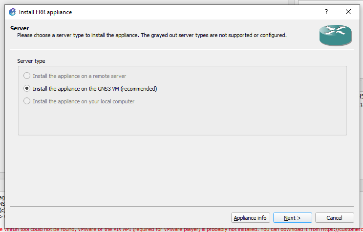{width=500px}
************************************************************
#### 2) Reproduction de cette topologie en configurant le routeur et les PC.
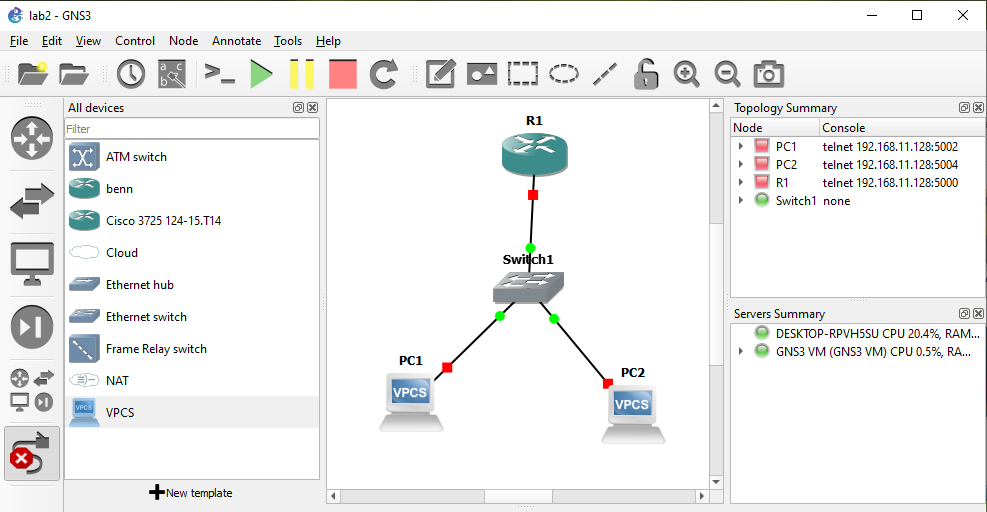{width=500px}
************************************************************
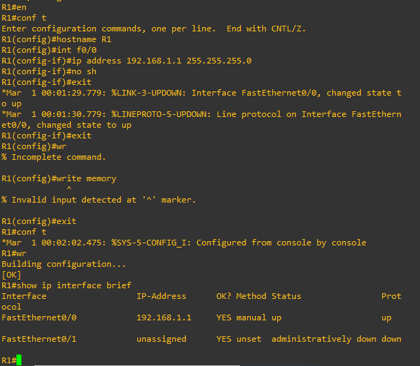{width=500px}
************************************************************
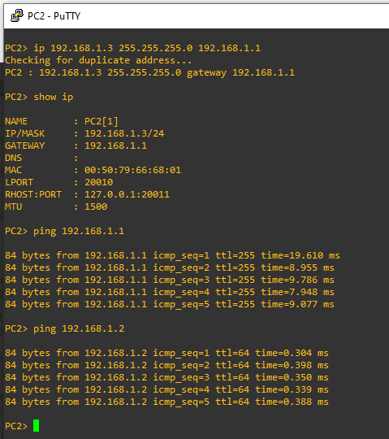{width=500px}
************************************************************
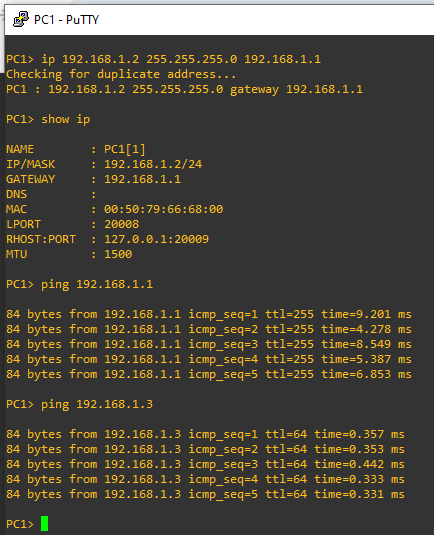{width=500px}
************************************************************
#### 2) Reproduction de la deuxieme topologie en configurant le routeur et les PC.
{width=500px}
************************************************************
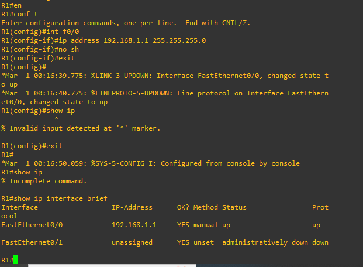{width=500px}
************************************************************
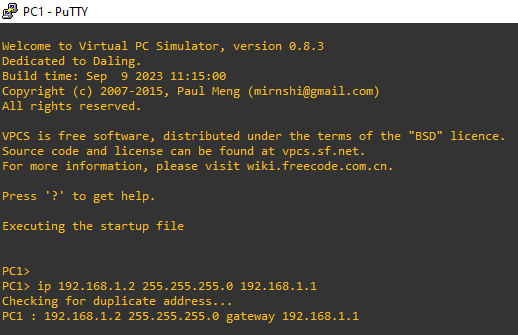{width=500px}
************************************************************
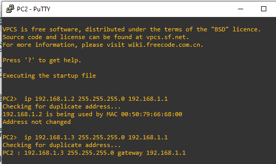{width=500px}
************************************************************
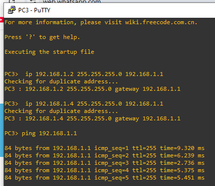{width=500px}
************************************************************
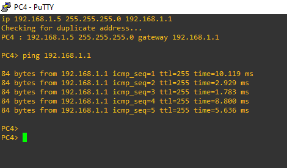{width=500px}
************************************************************
#### En Conclusion:
J’ai appris les compétences nécessaires pour Installer  et Configurer GN3, puis l'importer dans VMware et importer aussi un routeur dans GN3.