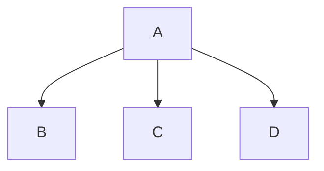

<div style="border: 3px solid red; padding: 10px;">
<p align="center">
  
</p>
<p align="center" style="color:red;">FACULTÉ DES SCIENCES ET DES TECHNOLOGIES
</p> 
<p align="center" style="color:red;">(FST)
</p> 
<p align="center" style="color:BLUE;"> Troisième année
</p> 
<p align="center" style="color:BLUE;"><b>RAPPORT</b></p>
<p align="center"><b>Sur le Travail de Laboratoire Nº1</b></p>
<p align="center" style="color:BLUE;"><b>COURS</b></p>
<p align="center"><b>Réseaux 2</b></p>
<p align="center" style="color:BLUE;"><b>PROFESSEUR</b></p>
<p align="center"><b>Ismael SAINT AMOUR</b></p>
<p align="center" style="color:BLUE;"><b>PRÉPARÉ PAR</b></p>
<p align="center"><b>Peterson CHERY</b></p>
<p align="center" style="color:BLUE;"><b>SEMESTRE</b></p>
<p align="center"><b>II</b></p>
<p align="right" style="color:blue;"><b>
  Le 15/03/2025
</b></p>
</div>

#### PLAN DU COURS
1. Partie 1
   - Configuration Réseau
   - Services Réseau
   - Introduction aux Serveurs de Messagerie et de Bases de Données
2. Partie 2
   - Outils de Surveillance Réseau
   - Wireshark
   - Les thèmes d’exposés
  
#### CONFIGURATION RÉSEAU
********************************************
#### *-1. Configuration de l’Adresse IP Statique*
1.1. Vérification des Interfaces Réseau Avant de commencer, il faut
identifier les interfaces réseau disponibles sur votre machine.
Utilisez la commande suivante pour lister les interfaces réseau sur
votre système Linux :
ip link show
Cela affichera toutes les interfaces réseau. Par exemple, eth0, enp0s3
ou wlan0 (pour les connexions sans fil) peuvent être les interfaces
réseau.
1.2. Configuration Manuelle de l’Adresse IP Sur une machine Linux,
vous pouvez définir une adresse IP statique en modifiant les fichiers
de configuration des interfaces réseau. Sur les systèmes basés sur
Debian (comme Ubuntu), vous modifiez le fichier
/etc/network/interfaces.
[Source] https://nordvpn.com/fr/blog/ip-statique/

**Lien des badges** 


____________________________________________
**Listes des taches** 
- [ ] Terminer la présentation du projet
- [ ] Réviser le rapport annuel
- [x] Envoyer l'email d'invitation pour la réunion
- [ ] Commander des fournitures de bureau
--------------------------------------------
**Un Tableau** 
| Tâche                     | Statut     | Date limite    |
|---------------------------|------------|----------------|
| Terminer la présentation  | En cours   | 20 mars 2025   |
| Réviser le rapport annuel | Non commencé | 25 mars 2025 |
| Envoyer l'email d'invitation | Terminé   | 15 mars 2025   |

```html
<!-- Exemple de syntaxe HTML -->
<div>
  <h1>Bienvenue!</h1>
  <p>Ceci est un exemple de bloc HTML inclus dans un document Markdown.</p>
  <ul>
    <li>Tâche 1 : Réaliser l'objectif</li>
    <li>Tâche 2 : Vérifier la progression</li>
  </ul>
</div>
```
#### Une Citation que j'ai aime de la Série The 100
> Que la paix accompagne ton envol. Et que l'amour t'accueille à ton arrivée. Que ton voyage se fasse sans encombre, En attendant le dernier qui nous mènera sur terre. Puissions-nous nous retrouver.
[Source](https://citations.ouest-france.fr/citation-serie-the-100/paix-accompagne-ton-envol-amour-135421.html)
____________________________________________

